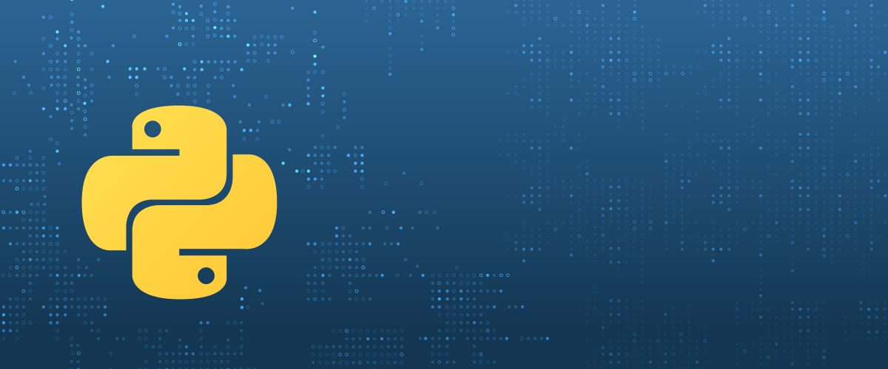

# 🐍 Comprehensive Python Course

## Description

Hello! I'm Jonatha Costa, and I'm excited to share my study journey with the Comprehensive Python Course. 🚀 This course is an amazing opportunity to master one of the most in-demand programming languages in the market, with applications in Data Science, Artificial Intelligence, and web development.

Throughout 64 hours of intense study, I delved into fundamental concepts to advanced topics, using the latest version of Python. The clear explanations and step-by-step approach made my learning both solid and practical.

## 📚 Topics Covered

- [Module 1: Variables and Data Types](./P_00/)
- [Logical and Conditional Structures](./P_01/)
- Decision and Loop Structures
- Collections (Lists, Tuples, Sets, etc.)
- Functions
- Lambda Expressions
- Debugging and Error Handling
- Modules
- File Reading and Writing
- Iterators and Generators
- Decorators
- Object-Oriented Programming
- Inheritance and Polymorphism
- Handling CSV and JSON Files
- Date and Time
- Testing
- Memory Allocation and Management
- Python 3.8 Updates
- Project 1: Game
- Project 2: Market
- Project 3: Bank
- And much more!

## 💡 Practical Exercises and Projects

This course is not just theoretical! Approximately 378 exercises are provided throughout the sections for hands-on learning. Develop three complete projects from scratch to gain a practical and in-depth understanding.
